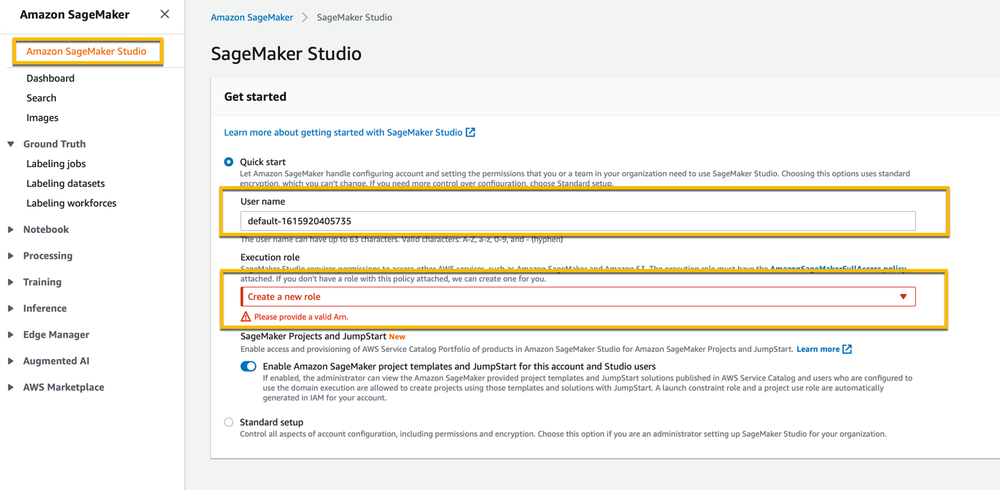
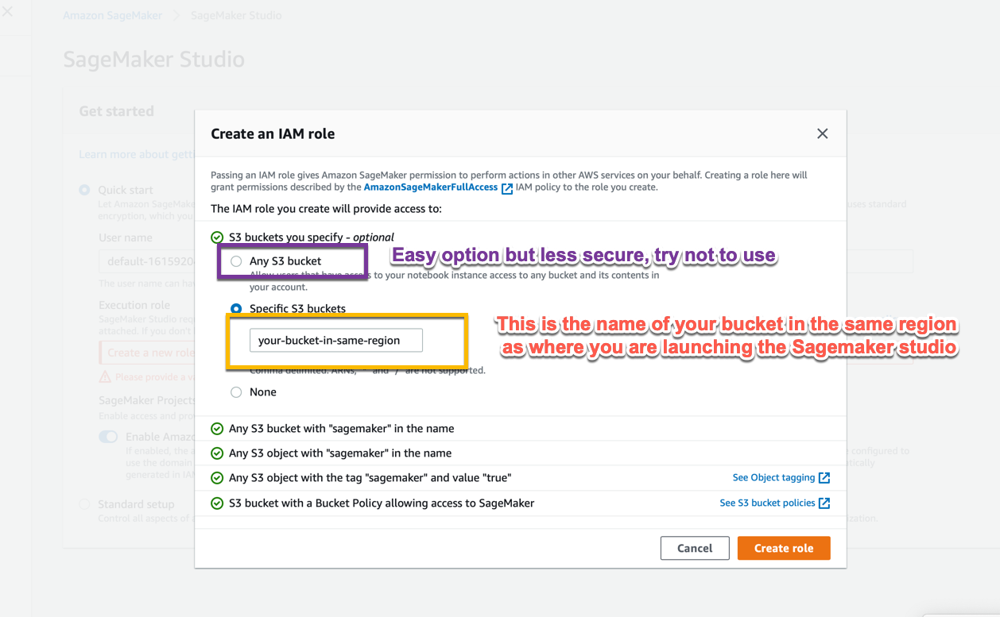
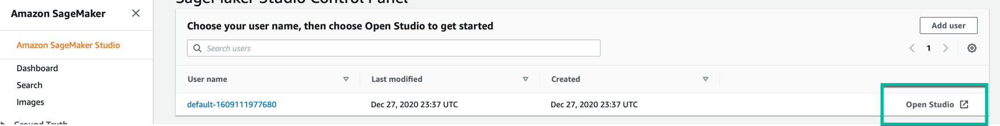
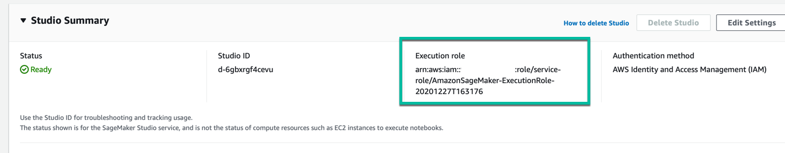
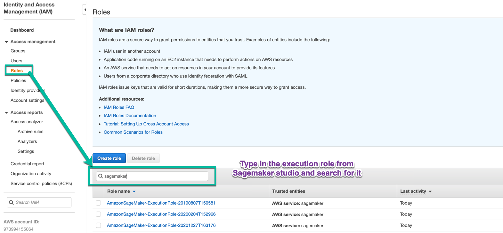

# Sagemaker Anamoly Detection - Random Cut Forest
Sagemaker Anamoly Detection Example

## Clone the Repo 
git clone https://github.com/GavinatorK/anamolydetection.git

## Create Sagemaker Studio

In the section for create an Execution Role, Choose Create a New Role.

For practice and dev environments, you can choose "Any bucket" but as a good practice confine it to the bucket you want to use,

*Note that you will have access to Sagemaker Default Bucket only if you set access to any bucket.*

After this step it takes you back to the previous screen where you click "Submit". This process takes a few mins and once it is complete you will something like below with an option to *open studio*

In case you get permission or IAM errors and you want to add or remove those permission,  you can find the execution role attached to Sagemaker Studio in the Studio Summary Section, shown below. 

*Note: you only need the last part after ("/")*

The way you can find this in IAM console is shown below 

